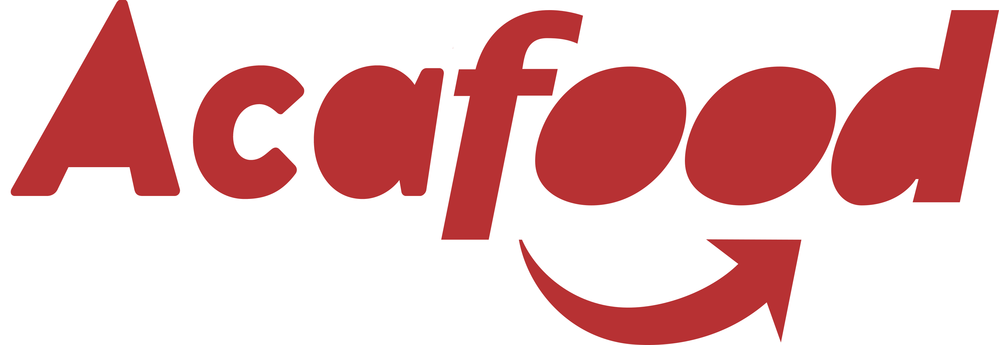
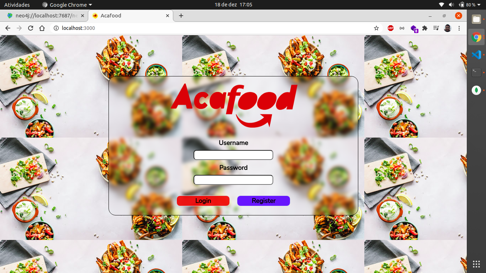
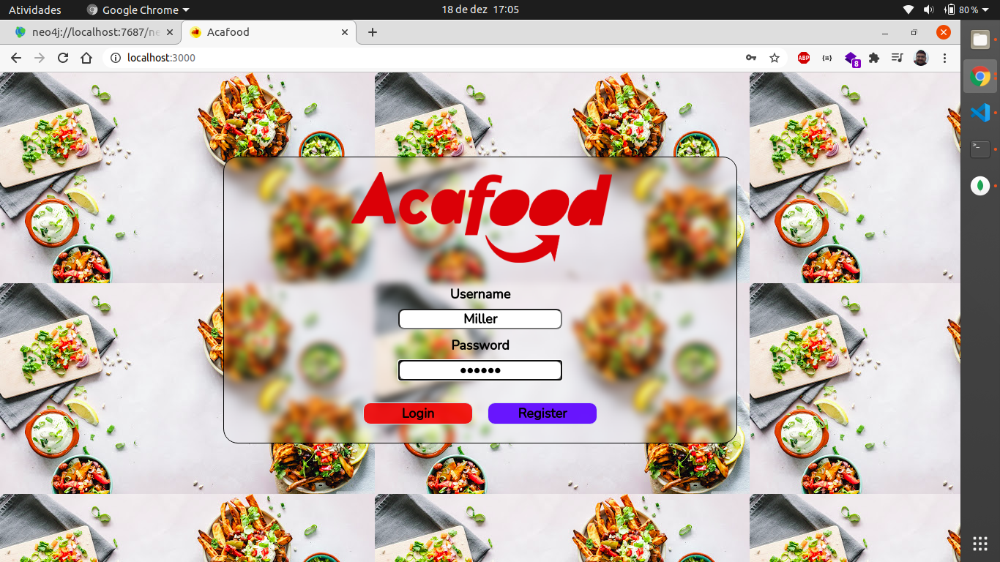
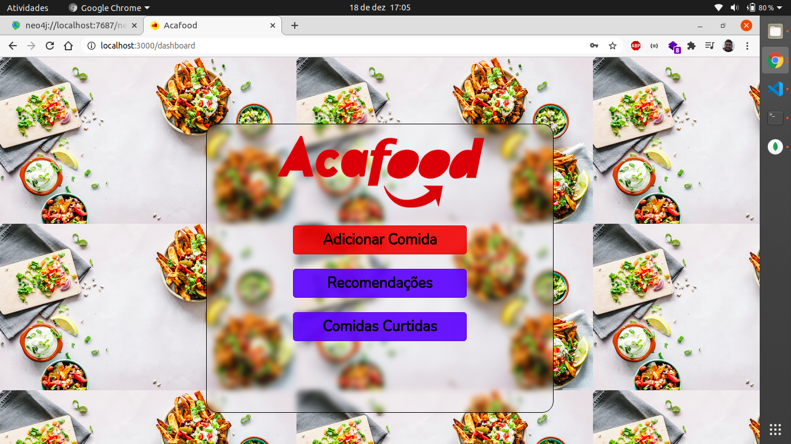
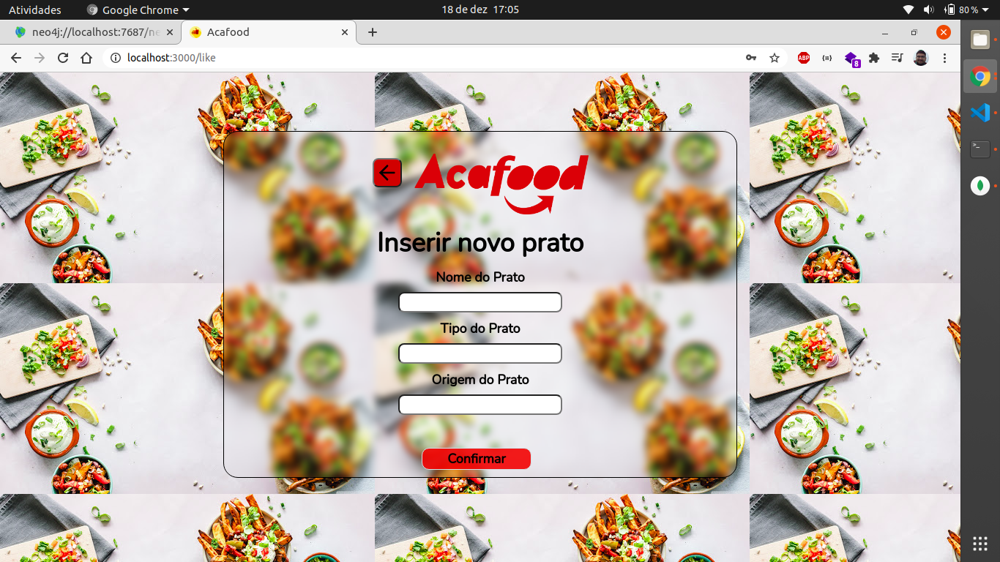
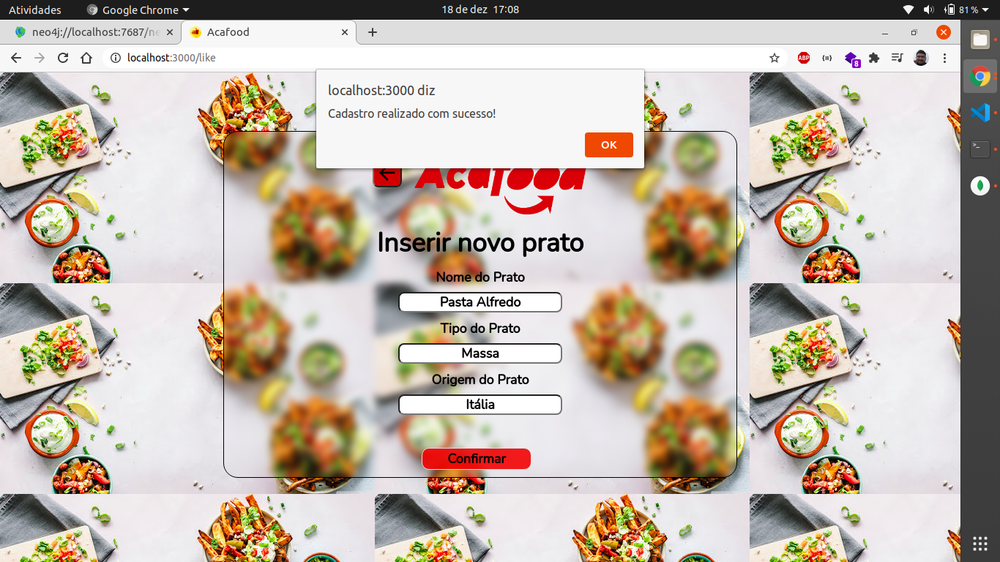
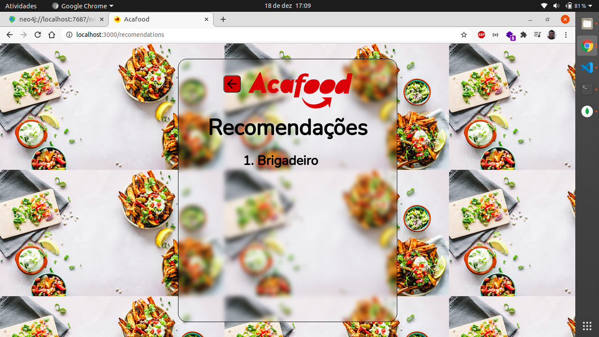
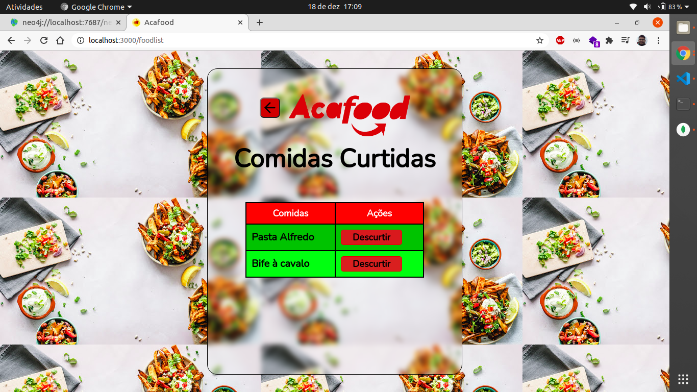

# Projeto_Final_BDII_Acafood

<p align="center">
  
</p>

### Acafood

Acafood é uma sistema de recomendações de comidas, basta realizar o cadastro, inserir comidas que você gosta e o sistema irá recomendar comidas que pessoas com o mesmo gosto que você também estão comendo

### Tecnologias

- [Node](https://nodejs.org/en/)
- [MongoDB](https://www.mongodb.com/1)
- [SQLite](https://www.sqlite.org/index.html)
- [Neo4j](https://neo4j.com/)
- [React](https://reactjs.org/)

### Instalação e uso

O Acafood é um sistema poliglota, ele se utiliza de 3 bancos de dados para a aplicação, primeiramente cole esse repoistório ou baixe-o

```bash
$ git clone https://github.com/millerraycell/Projeto_Final_BDII_Acafood.git
```

### Banco SQLite

Para startar o primeiro banco basta abrir um terminal na pasta backend1, e inserir o comando
```bash
$ yarn install
```

Depois que as dependências forem baixadas (pode demorar) insira o comando
```bash
$ yarn dev
```

### Banco Neo4j
Para startar o primeiro banco, você terá que ter o banco neo4j rodando no seu computador, pode ser que a porta do banco no seu computador seja diferente da especificada no código, para todo caso basta descobrir a porta do banco neo4j no seu computador acessar a pasta backend2 na pasta routes, no arquivo routes.js, na linha 6, basta alterar a porta, o login e senha do banco que estaremos prontos

Primeiramente com um terminal aberto na pasta backend 2, rode o comando para baixar as dependências (pode demorar)
```bash
$ yarn install
```

Por fim basta inserir no terminal
```bash
$ yarn dev
```

### Banco MongoDB

Para rodar a parte do MongoDB da aplicação, basta acessar a pasta src da pasta backend3, no aquivo server.ts basta inserir as suas credenciais do mongo

Com um terminal aberto na pasta backend3 insira o comando, para baixar as dependências (pode demorar)
```bash
$ yarn install
```

Para rodar a parte da plicação usando o MongoDB, basta inserir no terminal
```bash
$ yarn dev
```

### Frontend
Para rodar o Frontend da aplicação basta abrir um terminal na pasta web e inserir o comando, para baixar as dependências (pode demorar)
```bash
$ yarn install
```

e por fim basta rodar o comando

```bash
$ yarn start
```

E será aberto uma janela no seu navegador com o Acafood.

### Prints do Acafood

- Tela de Login
<p align="center">
  
</p>

- Tela de Login com usuário Miller, senha 123456
<p align="center">
  
</p>

- Dashboard do Acafood
<p align="center">
  
</p>

- Cadastrar nova comida que você gosta
<p align="center">
  
</p>

- Exemplo de nova comida cadastrada
<p align="center">
  
</p>

- Tela de recomendação
<p align="center">
  
</p>

- Tela com as comidas que o usuário cadastrou e removendo uma curtida de comida
<p align="center">
  
</p>

- Tela com as comidas que o usuário cadastrou atualizadas
<p align="center">
  
</p>

### Agradecimentos
Para que esse projeto fosse possível, muitas pessoas foram de suma importância e nada mais justo para com elas do que citá-las

- Joshua Kook Ho, muito obrigado pelo apoio técnico e pela disposição em ajudar
- Tarlison Sander, muito obrigado pelo apoio técnico e pela disposição em ajudar
- Josemar Rocha, muito obrigado pelo apoio emocional para eu não desistir desse projeto
- Markus Kaul, muito obrigado pelo seu esforço ao fazer a logo

E a todos os outros envolvidos meu muito obrigado, amo vocês <3